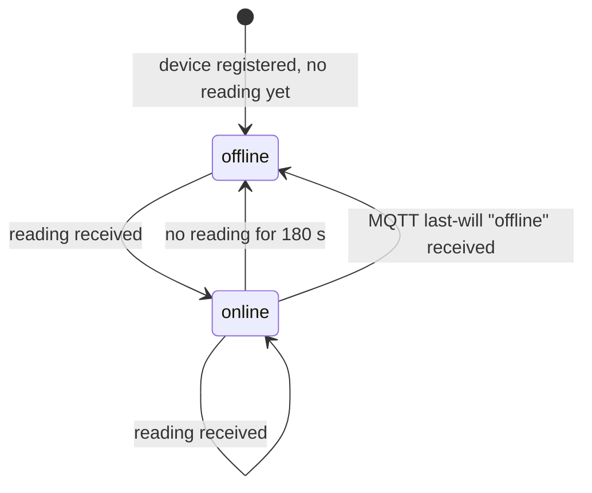

# Live Bench — API Contract v1

2026-09-17 · @Sai Kham

## Purpose

This contract is the referee between the Next.js live widget and the FastAPI backend: both are built against it, so neither waits on the other. The frontend mock returns exactly the example responses below; the backend's tests assert that real responses match them. Any change goes in the Changelog first, then into code.

Status: draft v1, written before either side exists. Field names follow the project brief's DB schema (`readings`, `devices`, `presence` not `occupancy`).

## Conventions

Every endpoint lives under `https://api.<domain>/v1`; the path prefix is the version, and v1 never changes shape once the frontend ships against it.

| Convention | Rule |
| --- | --- |
| Timestamps | ISO 8601 with a `Z` suffix, always UTC, e.g. `2026-09-17T09:12:00Z`. The browser converts to local time. |
| Temperature | Degrees Celsius, one decimal place, e.g. `23.4`. |
| Light level | Normalised `0`–`100` (percent of the LDR's calibrated range), integer. The API never exposes the raw 0–4095 ADC value. |
| Presence | Boolean `true` / `false`. Field name is `presence`, never `occupancy`. |
| Device id | Lower-case slug, e.g. `bench-01`. |
| Nulls | A sensor read that failed on the device is sent as `null` for that field, never `0` or `-1`. |
| Content type | `application/json` for REST, `text/event-stream` for the stream. |
| CORS | Read endpoints allow the portfolio domain only. |
| Errors | JSON body `{ "error": "<code>", "message": "<human text>" }` with the matching HTTP status. Codes used in v1: `device_not_found` (404), `invalid_parameter` (422). |
| Caching | `GET /latest` sends `Cache-Control: no-store`; `GET /history` sends `max-age=60`. |

## Entities

Two objects appear everywhere; every endpoint returns one or both of them, never a differently shaped copy.

**Reading** — one telemetry sample from one device.

| Field | Type | Nullable | Notes |
| --- | --- | --- | --- |
| `device_id` | string | no | e.g. `bench-01` |
| `timestamp` | ISO 8601 UTC | no | When the device took the sample, not when the backend stored it |
| `temperature` | number (°C, 1 dp) | yes | `null` if the DHT22 read failed |
| `light_level` | integer 0–100 | yes | `null` if the ADC read failed |
| `presence` | boolean | yes | PIR triggered within the last publish interval |

**Device** — the current state of one device.

| Field | Type | Nullable | Notes |
| --- | --- | --- | --- |
| `device_id` | string | no |  |
| `status` | `"online"` or `"offline"` | no | See the state machine below |
| `last_seen` | ISO 8601 UTC | yes | Timestamp of the most recent Reading; `null` if none ever received |
| `publish_interval_s` | integer | no | `60` for v1; lets the frontend compute "stale" without hard-coding |

**HistoryBucket** — one aggregated row for the chart (history endpoint only).

| Field | Type | Nullable | Notes |
| --- | --- | --- | --- |
| `bucket_start` | ISO 8601 UTC | no | Start of the 5-minute window |
| `temperature_avg` | number (°C, 1 dp) | yes | Mean of non-null readings in the window |
| `light_level_avg` | integer 0–100 | yes | Mean of non-null readings in the window |
| `presence_any` | boolean | yes | `true` if any reading in the window had presence |
| `sample_count` | integer | no | Readings in the window; `0` means a gap (device was offline) |

## Device state machine

A device is `offline` when the backend has heard nothing for 3 minutes (3× the 60 s publish interval); one reading brings it back `online`. Both sides implement this rule: the backend to set `status`, the frontend only to decide what to render when the stream drops.



The MQTT last-will message is the fast path (seconds); the 180 s timer is the safety net for a silent drop. Whichever fires first wins, and the backend emits one `status` stream event per transition, never per check.

| Frontend state | Trigger | What renders |
| --- | --- | --- |
| Live | `status` = `online` and stream connected | Badge "LIVE", values, chart updating |
| Offline | `status` = `offline` | Badge "OFFLINE", last-known values dimmed, chart kept, "last seen 2h 14m ago" from `last_seen` |
| Error | REST or stream request fails | Error card with retry; cached values if any were loaded |

## GET /v1/devices/{device\_id}/latest

Returns the device's current state and its most recent reading in one call, so the widget renders its first frame from a single request.

**Parameters:** none beyond the path.

**200 response**

```json
{
  "device": {
    "device_id": "bench-01",
    "status": "online",
    "last_seen": "2026-09-17T09:12:00Z",
    "publish_interval_s": 60
  },
  "reading": {
    "device_id": "bench-01",
    "timestamp": "2026-09-17T09:12:00Z",
    "temperature": 23.4,
    "light_level": 41,
    "presence": true
  }
}
```

`reading` is `null` when the device exists but has never reported.

**Errors:** `404 device_not_found`.

## GET /v1/devices/{device\_id}/history

Returns readings aggregated into fixed 5-minute buckets for the chart. Buckets align to the clock (`:00`, `:05`, `:10`…), so two calls a minute apart return the same bucket boundaries.

| Parameter | Type | Default | Limits |
| --- | --- | --- | --- |
| `hours` | integer | `24` | `1`–`168` |

**200 response**

```json
{
  "device_id": "bench-01",
  "bucket_s": 300,
  "from": "2026-09-16T09:10:00Z",
  "to": "2026-09-17T09:10:00Z",
  "buckets": [
    {
      "bucket_start": "2026-09-16T09:10:00Z",
      "temperature_avg": 22.9,
      "light_level_avg": 38,
      "presence_any": false,
      "sample_count": 5
    },
    {
      "bucket_start": "2026-09-16T09:15:00Z",
      "temperature_avg": null,
      "light_level_avg": null,
      "presence_any": null,
      "sample_count": 0
    }
  ]
}
```

Rules both sides follow:

- Every bucket in the window is present, oldest first, including empty ones (`sample_count: 0`, aggregates `null`). The chart draws a gap there, never a line across it.
- `hours=24` therefore always returns exactly 288 buckets.
- Averages are rounded server-side; the frontend never rounds.

**Errors:** `404 device_not_found`, `422 invalid_parameter` when `hours` is outside its limits.

## GET /v1/devices/{device\_id}/stream

A Server-Sent Events stream that pushes each new reading and each status change; the browser opens it once after `/latest` and keeps it open for the life of the page.

**Response headers:** `Content-Type: text/event-stream`, `Cache-Control: no-cache`, `Connection: keep-alive`.

| Event | When | `data` payload |
| --- | --- | --- |
| `status` | Immediately on connect, then on every online/offline transition | A Device object |
| `reading` | Every time the backend stores a new reading | A Reading object |
| `ping` | Every 25 s with no other traffic | `{}` — keeps proxies from closing the socket |

**Wire format example**

```
event: status
id: 1758100320000
data: {"device_id":"bench-01","status":"online","last_seen":"2026-09-17T09:12:00Z","publish_interval_s":60}

event: reading
id: 1758100380000
data: {"device_id":"bench-01","timestamp":"2026-09-17T09:13:00Z","temperature":23.5,"light_level":42,"presence":true}

```

Rules:

- `id` is the event's Unix time in milliseconds. A reconnecting browser sends it back as `Last-Event-ID`; the backend replays any readings after it (up to 10 minutes), so a brief tab-in-background drop leaves no hole in the chart.
- The frontend reconnects with the browser's built-in `EventSource` backoff; it does not implement its own retry loop.
- If the stream is unreachable, the frontend falls back to polling `/latest` every 60 s and shows the Live badge only if `status` is `online` — it never shows the Error state just because the stream failed while REST still works.

**Errors:** `404 device_not_found` before the stream opens; once open, errors close the connection and the browser reconnects.

## GET /v1/health

A liveness check for the uptime monitor and CI smoke tests; not called by the frontend.

**200 response**

```json
{
  "status": "ok",
  "db": "ok",
  "mqtt": "connected",
  "version": "0.1.0"
}
```

Returns `503` with the same shape and the failing component's value set to `"error"` when the database is unreachable or the MQTT subscriber has been disconnected for more than 60 s.

## MQTT payloads (device → broker → backend)

The firmware publishes the same Reading shape the API serves, so the backend validates once and stores without translation. This section is the firmware's contract; the fake-device script used before hardware arrives follows it exactly.

| Topic | QoS | Retained | Payload |
| --- | --- | --- | --- |
| `devices/{device_id}/telemetry` | 1 | no | Reading JSON plus `rssi` (integer dBm) and `uptime_s` (integer); the backend stores `rssi` and `uptime_s` for the Phase 2 health page but does not expose them in v1 |
| `devices/{device_id}/status` | 1 | yes | The string `online` on connect; `offline` as the last-will message set at connect time |

**Telemetry example**

```json
{
  "device_id": "bench-01",
  "timestamp": "2026-09-17T09:12:00Z",
  "temperature": 23.4,
  "light_level": 41,
  "presence": true,
  "rssi": -61,
  "uptime_s": 86412
}
```

Rules:

- `timestamp` comes from the device's NTP-synced clock. If NTP has not synced yet (first boot), the device omits the field and the backend substitutes its own receive time and sets `sample_count` normally.
- Buffered readings flushed after a reconnect keep their original `timestamp`, so a 5-minute outage back-fills rather than piling up at the reconnect moment.
- Payloads that fail validation (unknown `device_id`, out-of-range values, malformed JSON) are logged and dropped; they never crash the subscriber.
- Per-device credentials: broker ACL restricts each device to its own two topics; the backend subscribes to `devices/+/telemetry` and `devices/+/status`.

## Not in scope for v1

Listed so they are not added out of habit; each is a v2 changelog entry if it ever arrives.

- Authentication on read endpoints (the data is public by design)
- Any write endpoint — devices are registered by a migration, not an API
- Pagination — the largest response is 2,016 buckets at `hours=168`
- Multiple devices in one response — the widget shows one device; a list endpoint comes with the Phase 2 health page
- Raw (un-bucketed) readings over the API
- `rssi`, `uptime_s`, packet loss — stored but not served until Phase 2
- WebSocket — SSE is one-directional and sufficient

## Changelog

| Date | Change | Why |
| --- | --- | --- |
| 2026-09-17 | v1 draft | Written before frontend or backend exist, so both build against it |
